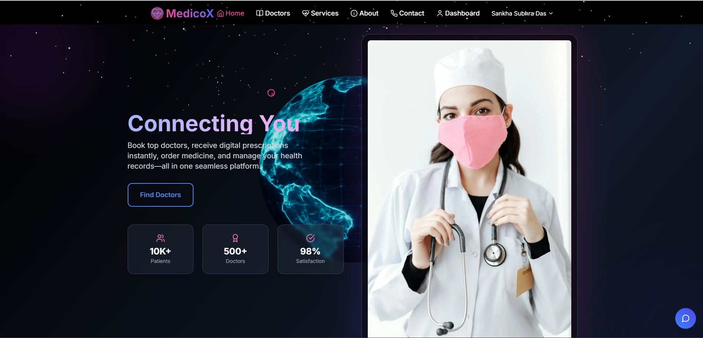

<!--
  Profile README template (updated for Sankha Subhra Das)
  Extended tech badges + Features section added.
-->

<table>
  <tr>
    <!-- LEFT COLUMN: avatar, short bio, links, trophies -->
    <td width="30%" valign="top" style="padding-right: 20px;">

### Hi, I'm Sankha Subhra Das 👋

**Sankha Subhra Das**  
`@sankha1545` • Full-stack web developer • Recent B.Tech (CSE) graduate

*Recent B.Tech (CSE) graduate from UEM, Kolkata — full-stack web developer building clean, scalable web apps. Currently exploring cloud-native deployment and developer tooling. Open to internships and early-career roles.*

- 🔭 I’m working on **VectorShift** (pipeline builder)
- 🌱 I’m learning cloud-native deployment & developer tooling
- 💬 Ask me about JS, React, FastAPI, DevOps
- 📫 Reach me: [sankhasubhradas1@gmail.com](mailto:sankhasubhradas1@gmail.com)

---

#### Achievements

  

#### Highlights
- ⚙️ Built production-ready React UI with complex node editing (VectorShift)
- 📦 Containerized projects with Docker and set up CI/CD pipelines
- 🎥 Create concise demo videos to showcase projects and flows

    </td>

    <!-- RIGHT COLUMN: tech stack badges, stats, languages, contribution graph -->
    <td width="70%" valign="top">

### 🧰 Tech & Tools

<!-- additional requested stacks -->

---

### 📊 GitHub Stats

  
  

---

### 📈 Contributions & Activity

---

### 🚀 Selected Projects
- **VectorShift** — Demo-ready web app for pipeline building. (Repo: `https://github.com/sankha1545/VectorShift`)  
  *Implemented front-end UI, integrated backend APIs, containerized with Docker.*
- **MedicoX** — a full stack tele-medical web application. (Repo: `https://github.com/sankha1545/MEDICO`)
- **PLANO** — a to-do list web application. (Repo: `https://github.com/sankha1545/Todolist-alienBrains-`)

### My Top Project

---

### 💼 Experience
**Front-end Intern at ALienBrains** — (via college placement)  
- Built responsive UI components, worked with REST APIs, improved performance and accessibility.  
- Gained hands-on experience deploying apps and working with backend services.

---

### 📚 Learning & Interests
- Currently deepening knowledge in **cloud deployments**, **CI/CD pipelines**, and **scalable backend design**.
- Interested in developer experience, modern web tooling, and mentoring/junior dev growth.

---

---

### 📫 Contact
- ✉️ Email: [sankhasubhradas1@gmail.com](mailto:sankhasubhradas1@gmail.com)
- 🔗 LinkedIn: [Sankha Subhra Das](https://www.linkedin.com/in/sankha-subhra-das-625ab6201/)
- 🧾 Portfolio: [myportfolioxyx.netlify.app](https://myportfolioxyx.netlify.app)

---

### ⚡ Fun facts
- I enjoy making concise demo videos to showcase projects.
- I like to break down complex features into small, testable commits.

---

> **If you're a recruiter:** I'm open to full-time/junior roles or internships — feel free to check my portfolio and reach out!

---

<table>
  <tr>
    <th>Area</th>
    <th>Tools</th>
  </tr>
  <tr>
    <td>Frontend</td>
    <td>React, Next.js, Tailwind, TypeScript, JavaScript, React Native, HTML, CSS</td>
  </tr>
  <tr>
    <td>Backend</td>
    <td>Node.js, REST API, Express, MySQL, MongoDB, Java</td>
  </tr>
  <tr>
    <td>Cloud / DevOps</td>
    <td>Docker, GitHub Actions, CI/CD, AWS, Containerisation, Monitoring (Prometheus + Grafana)</td>
  </tr>
  <tr>
    <td>Security & Auth</td>
    <td>Web Security best-practices, OAuth, OpenID Connect, HTTPS / TLS</td>
  </tr>
</table>
